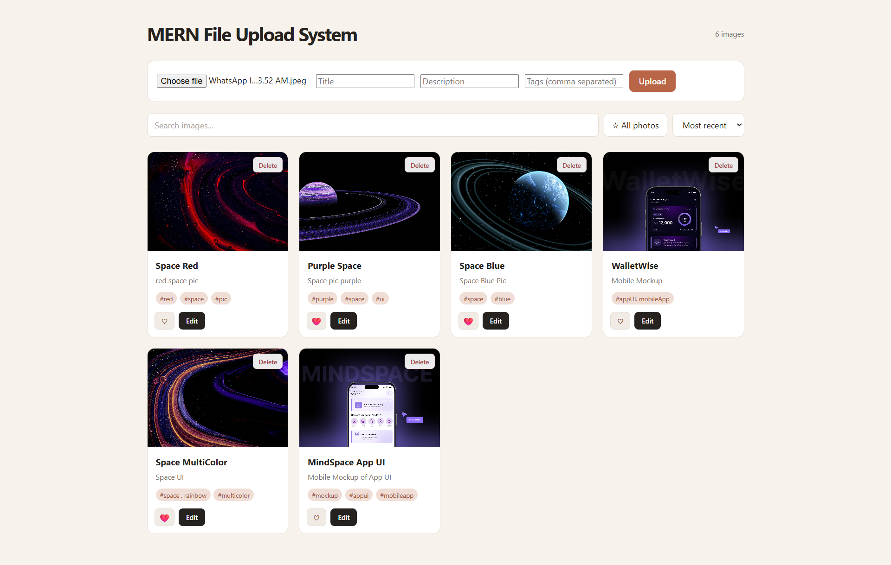
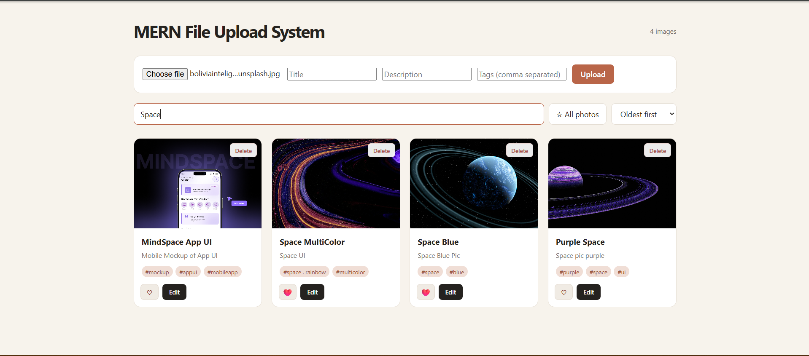
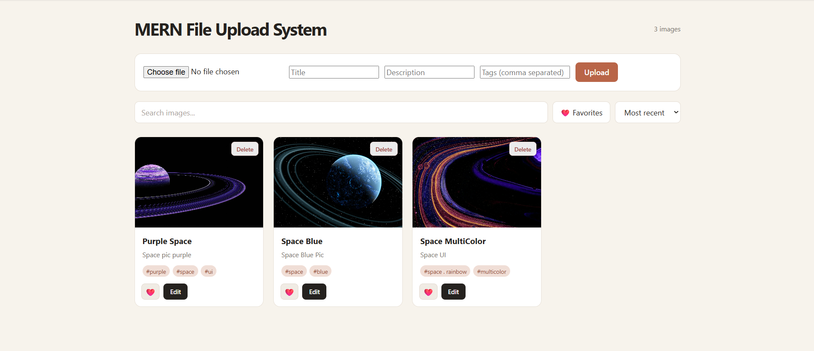
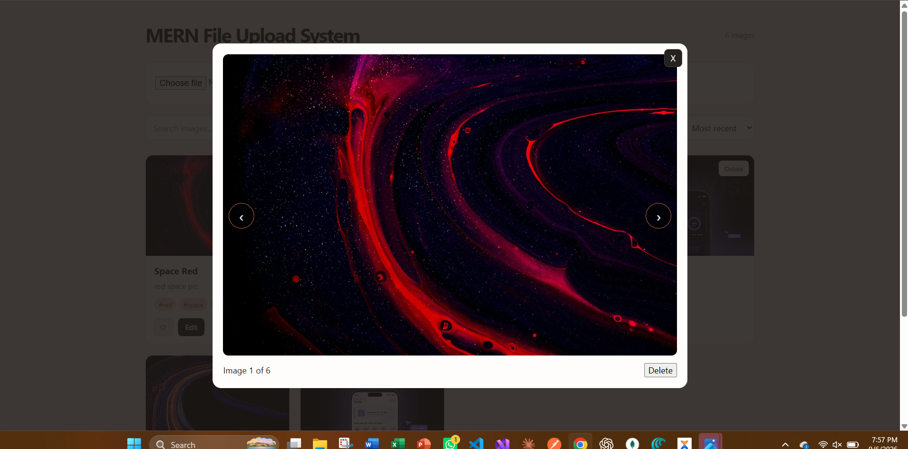
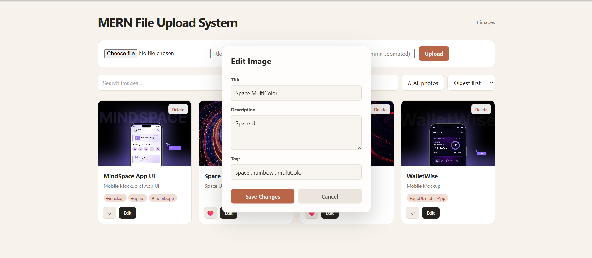

<div align="center">


<br>

# MERN FILE UPLOAD SYSTEM

### Upload. Manage. Organize.

<p>
  <strong>A full-stack file upload and image management system with a built-in gallery.</strong>
</p>

<p>
  Built with React, Node.js, Express.js, MongoDB, Mongoose & Multer.
</p>

<br>


<br><br>


</div>

---

## 📖 About

**MERN File Upload System** is a full-stack application focused on handling **image uploads, file storage, metadata management, and gallery-based organization**.

The system allows users to upload images along with titles, descriptions, and tags, then browse, search, filter, sort, favorite, edit, preview, and delete uploaded files through an interactive gallery interface.

The primary technical focus is **Multer-based file uploading** and the complete flow between the React frontend, Express backend, local file system, and MongoDB database.

---

## ✨ Features

<table>
<tr>

<td width="33%" valign="top">

### 📤 File Upload

* Upload images
* Multipart form handling
* Add title & description
* Add multiple tags
* Form validation
* Store file metadata

</td>

<td width="33%" valign="top">

### 🗂️ Gallery

* Browse uploaded images
* Interactive image cards
* Full image preview
* Previous / next navigation
* Dynamic gallery updates

</td>

<td width="33%" valign="top">

### 🔍 Search & Filter

* Search by title
* Search by description
* Search by tags
* Case-insensitive search
* Favorites-only filtering

</td>

</tr>

<tr>

<td width="33%" valign="top">

### ❤️ Favorites

* Add images to favorites
* Remove from favorites
* Favorites-only view
* Persistent favorite state

</td>

<td width="33%" valign="top">

### ✏️ Edit Metadata

* Edit title
* Edit description
* Edit tags
* Update image metadata
* Preserve existing image

</td>

<td width="33%" valign="top">

### 🗑️ File Deletion

* Delete image
* Delete database record
* Remove local image file
* Confirmation before deletion

</td>

</tr>

<tr>

<td width="33%" valign="top">

### 📊 Sorting

* Recent images
* Oldest images
* Database-level sorting
* Dynamic results

</td>

<td width="33%" valign="top">

### 🏷️ Metadata

* Titles
* Descriptions
* Tags
* Tag normalization
* Creation dates

</td>

<td width="33%" valign="top">

### 📱 UI / UX

* Responsive layout
* Interactive controls
* Empty states
* Form states
* Accessible controls

</td>

</tr>
</table>

---

## 🖥️ Screenshots

### 🏠 Gallery

<p align="center">
  
</p>

### 🔍 Search

<p align="center">
  
</p>

### ❤️ Favorites

<p align="center">
  
</p>

### 🖼️ Image Preview

<p align="center">
  
</p>

### ✏️ Edit Metadata

<p align="center">
  
</p>

---

## 🔄 User Flow

```text
                         USER
                           │
                           ▼
                    Open Application
                           │
                 ┌─────────┴─────────┐
                 ▼                   ▼
           Browse Gallery       Upload File
                 │                   │
                 │             Add Metadata
                 │                   │
                 │                   ▼
                 │              Submit File
                 │                   │
                 │                   ▼
                 │             Multer Upload
                 │                   │
                 │          ┌────────┴────────┐
                 │          ▼                 ▼
                 │      Local File         MongoDB
                 │       Storage           Metadata
                 │          │                 │
                 └──────────┴─────────────────┘
                            ▼
                      Updated Gallery
                            │
              ┌─────────────┼─────────────┐
              ▼             ▼             ▼
            Search       Favorite        Edit
              │             │             │
              └─────────────┼─────────────┘
                            ▼
                           View
                            │
                            ▼
                          Delete
                            │
                            ▼
                     Updated System
```

---

## 🏗️ Application Architecture

```text
┌──────────────────────────────────────────────┐
│                  FRONTEND                    │
│                                              │
│               React + Vite                   │
│                                              │
│  Components → State → API Functions → Axios │
└──────────────────────┬───────────────────────┘
                       │
                       │ HTTP / REST API
                       ▼
┌──────────────────────────────────────────────┐
│                   BACKEND                    │
│                                              │
│            Node.js + Express.js              │
│                                              │
│       Routes → Middleware → Mongoose         │
│                    │                         │
│              Multer Middleware               │
└───────────────┬──────────────┬───────────────┘
                │              │
                ▼              ▼
        ┌──────────────┐  ┌──────────────┐
        │   MongoDB    │  │ Local Uploads│
        │              │  │              │
        │ File Metadata│  │ Image Files  │
        └──────────────┘  └──────────────┘
```

### Data Flow

```text
User Selects File
        ↓
React Upload Form
        ↓
multipart/form-data
        ↓
Axios Request
        ↓
Express Route
        ↓
Multer Middleware
        ↓
Local Uploads Folder
        ↓
File URL + Metadata
        ↓
MongoDB
        ↓
JSON Response
        ↓
React State Update
        ↓
Gallery Updated
```

---

## 🎯 Project Focus

The primary focus of **MERN File Upload System** is implementing **file and image uploads using Multer** within a full-stack MERN application.

The project demonstrates how a selected image travels from the frontend upload form through the backend and finally becomes part of the gallery.

### Core Focus Areas

| Focus                | Implementation                                                      |
| -------------------- | ------------------------------------------------------------------- |
| 📁 **Multer**        | Handles `multipart/form-data` image uploads                         |
| 🖼️ **File Storage** | Stores uploaded images locally on the server                        |
| 🔗 **File URLs**     | Connects stored files with database records                         |
| 🍃 **MongoDB**       | Stores image metadata and file information                          |
| 🔄 **CRUD**          | Create, read, update, and delete uploaded images                    |
| 🌐 **REST API**      | Connects frontend actions with backend operations                   |
| ⚛️ **React**         | Handles upload forms, gallery state, filtering, and UI              |
| 🗂️ **Gallery**      | Provides browsing, previewing, searching, sorting, and organization |

---

## 🧠 Concepts Used

<table>
<tr>
<th>Category</th>
<th>Concepts</th>
<th>Implementation</th>
</tr>

<tr>
<td><strong>📁 File Upload</strong></td>
<td>

Multer<br>
multipart/form-data<br>
File Handling<br>
Local Storage<br>
File Naming<br>
File Deletion

</td>
<td>

Processing uploaded images and managing files on the server

</td>
</tr>

<tr>
<td><strong>⚛️ React</strong></td>
<td>

Functional Components<br>
Component Composition<br>
Props<br>
State Management<br> <code>useState</code><br> <code>useEffect</code><br>
Controlled Forms<br>
Conditional Rendering<br>
Dynamic Lists

</td>
<td>

Dynamic gallery UI, upload forms, filtering, and state synchronization

</td>
</tr>

<tr>
<td><strong>🌐 REST API</strong></td>
<td>

GET<br>
POST<br>
PATCH<br>
DELETE<br>
Query Parameters<br>
HTTP Status Codes<br>
JSON Responses<br>
Error Handling

</td>
<td>

Communication between the React frontend and Express backend

</td>
</tr>

<tr>
<td><strong>🟢 Node.js & Express</strong></td>
<td>

Express Server<br>
Express Router<br>
Middleware<br>
Route Handlers<br>
Async/Await<br>
Environment Variables<br>
Static File Serving

</td>
<td>

Server-side routing, middleware processing, API logic, and file serving

</td>
</tr>

<tr>
<td><strong>🍃 MongoDB & Mongoose</strong></td>
<td>

Schemas<br>
Models<br>
CRUD Operations<br>
Validation<br>
Query Filtering<br>
Regex Search<br>
Sorting<br>
Document Updates

</td>
<td>

Storing file metadata, searching, filtering, sorting, and updates

</td>
</tr>

<tr>
<td><strong>🔗 Frontend ↔ Backend</strong></td>
<td>

Axios<br>
API Abstraction<br>
Async Requests<br>
Promises<br>
Loading States<br>
Error Handling<br>
Data Fetching

</td>
<td>

Sending upload requests, fetching data, handling mutations, and updating UI

</td>
</tr>

<tr>
<td><strong>🔄 CRUD</strong></td>
<td>

Create<br>
Read<br>
Update<br>
Delete

</td>
<td>

Complete file and metadata management lifecycle

</td>
</tr>

</table>

---

## 🔌 REST API

| Method   | Endpoint                   | Description                |
| -------- | -------------------------- | -------------------------- |
| `POST`   | `/api/images`              | Upload image with metadata |
| `GET`    | `/api/images`              | Fetch gallery images       |
| `PATCH`  | `/api/images/:id`          | Update image metadata      |
| `PATCH`  | `/api/images/:id/favorite` | Update favorite status     |
| `DELETE` | `/api/images/:id`          | Delete image               |

### 🔎 Query Parameters

**Search images**

```http
GET /api/images?search=nature
```

**Show favorites**

```http
GET /api/images?favorite=true
```

**Sort by oldest**

```http
GET /api/images?sort=oldest
```

**Combine filters**

```http
GET /api/images?search=sunset&favorite=true&sort=recent
```

---

## 📤 Multer Upload Flow

Multer is the central file-handling component of the application.

```text
React Upload Form
       ↓
multipart/form-data
       ↓
Axios
       ↓
Express Route
       ↓
Multer Middleware
       ↓
Validate & Process File
       ↓
Save to /uploads
       ↓
Generate File URL
       ↓
Save Metadata in MongoDB
       ↓
Return Response
       ↓
Display in Gallery
```

### Upload Fields

```text
image
title
description
tags
```

### File Storage

Uploaded images are stored locally:

```text
server/
└── uploads/
    ├── image-1.jpg
    ├── image-2.png
    └── image-3.webp
```

MongoDB stores the image URL and related metadata rather than the image binary itself.

---

## 🔄 CRUD Implementation

```text
CREATE → Upload image + metadata
READ   → Fetch gallery images
UPDATE → Edit metadata / favorite state
DELETE → Remove image + database record
```

### Search

Images can be searched using:

* Title
* Description
* Tags

### Filtering

The backend dynamically builds query filters using URL parameters.

### Sorting

Images can be returned as:

* **Recent** → Newest first
* **Oldest** → Oldest first

---

## 🚀 Setup Guide

<details>
<summary><strong>Click to expand setup instructions</strong></summary>

<br>

### Requirements

| Requirement     | Technology           |
| --------------- | -------------------- |
| Frontend        | React.js + Vite      |
| Backend         | Node.js + Express.js |
| Database        | MongoDB              |
| ODM             | Mongoose             |
| HTTP Client     | Axios                |
| File Upload     | Multer               |
| Version Control | Git & GitHub         |

### 1. Clone the Repository

```bash
git clone <your-repository-url>
cd mern-gallery-starter-v2
```

### 2. Install Server Dependencies

```bash
cd server
npm install
```

### 3. Install Client Dependencies

```bash
cd ../client
npm install
```

### 4. Configure Environment Variables

Create a `.env` file inside the `server` directory:

```env
MONGO_URI=your_mongodb_connection_string
PORT=5000
```

> Keep your `.env` file private and never commit it to GitHub.

### 5. Start the Backend

```bash
cd server
npm run dev
```

The backend runs on:

```text
http://localhost:5000
```

### 6. Start the Frontend

Open another terminal:

```bash
cd client
npm run dev
```

Open the Vite development URL shown in the terminal.

</details>

---

## 🧪 API Testing

The REST API can be tested using **Postman** or another API testing tool.

### Upload Image

```http
POST /api/images
Content-Type: multipart/form-data
```

Form fields:

```text
image
title
description
tags
```

### Update Metadata

```http
PATCH /api/images/:id
Content-Type: application/json
```

```json
{
  "title": "Sunset",
  "description": "A beautiful evening sky",
  "tags": ["sunset", "sky", "nature"]
}
```

### Update Favorite

```http
PATCH /api/images/:id/favorite
Content-Type: application/json
```

```json
{
  "isFavorite": true
}
```

---

## 📌 Project Scope & Limitations

MERN File Upload System is primarily focused on **file uploading, local file handling, metadata management, and gallery-based organization**.

The current version uses local image storage and does not include:

* User authentication
* Authorization
* Cloud storage
* Production-grade deployment infrastructure
* Advanced user management
* Multiple file types beyond the implemented image-upload workflow

These limitations are intentional and keep the project focused on its primary learning objectives.

---

## 🛠️ Technology Stack

| Category         | Technology        |
| ---------------- | ----------------- |
| Frontend         | React.js          |
| Build Tool       | Vite              |
| Backend          | Node.js           |
| Server Framework | Express.js        |
| Database         | MongoDB           |
| ODM              | Mongoose          |
| HTTP Client      | Axios             |
| File Upload      | Multer            |
| API Style        | REST              |
| Storage          | Local File System |
| Version Control  | Git & GitHub      |

---

## 📚 Learning Outcomes

This project provided practical experience with:

* Implementing file uploads using **Multer**
* Handling `multipart/form-data`
* Managing uploaded files on the server
* Connecting uploaded files with MongoDB metadata
* Building a complete MERN application
* Creating and consuming REST APIs
* Connecting React with an Express backend
* Implementing CRUD operations
* Managing React state and forms
* Working with asynchronous API requests
* Implementing search, filtering, and sorting
* Building a functional image gallery
* Managing files and database records together
* Structuring a full-stack application

---

## 🎯 What This Project Demonstrates

```text
                 FILE UPLOAD SYSTEM
                         │
                         ▼
                  Select Image
                         │
                         ▼
                  React Frontend
                         │
                         ▼
                multipart/form-data
                         │
                         ▼
                  Express Backend
                         │
                         ▼
                  Multer Middleware
                         │
                  ┌──────┴──────┐
                  ▼             ▼
            Local File       MongoDB
              Storage       Metadata
                  │             │
                  └──────┬──────┘
                         ▼
                  Gallery Interface
                         │
          ┌──────────────┼──────────────┐
          ▼              ▼              ▼
       Search         Favorite         Edit
          │              │              │
          └──────────────┼──────────────┘
                         ▼
                       Delete
```

---

<div align="center">

### 📤 Upload. Manage. Organize.

**MERN File Upload System**

*React · Node.js · Express.js · MongoDB · Multer*

<br>


</div>
